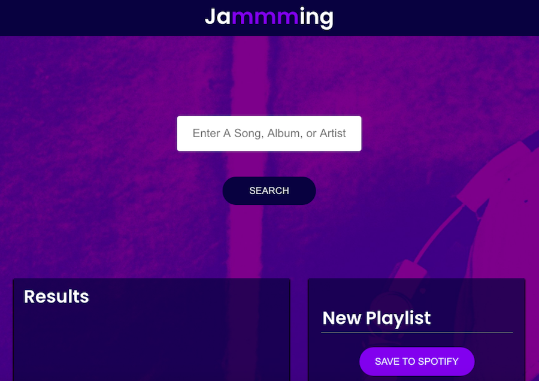

# Jammming

## About

An application that uses the Spotify API to allow users to search the Spotify library, create a custom playlist, then save it to their Spotify account.




## Motivation

Jammming is a guided project that is part of the [Codecademy Front-End Engineer](https://www.codecademy.com/learn/paths/front-end-engineer-career-path) career path.


## Technologies

React.


## Installation Instructions

```
$ git clone https://github.com/HannaEb/jammming.git
$ cd jammming
$ npm install
$ npm start
```

Then open [http://localhost:3000](http://localhost:3000) to view the application in the browser.


## Testing

Not yet implemented.


## Author

HannaEb
